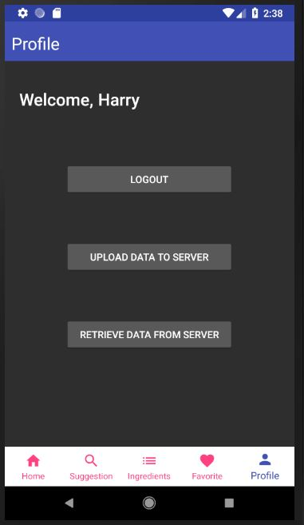

# Project Hash

A recipe suggestion application for Android, written in Kotlin.

# Attention
Since the server is not free, the server will shut down from 05/12/2018.
After that, you should use your own server to make sure the app can work.

# App Download & Install
[Download](https://github.com/HarryXu12138/ProjectHash/releases/download/v1.3.5/app-release.apk)

## How to install
#### Download installer on the phone
1. Click on the .apk file downloaded.
2. Enable 'Install from unknown souce'.
3. Click install.
4. Done!

#### Download installer on the computer
1. Connect the android phone to the computer via USB.
2. Drag the .apk file to the phone folder.
3. Follow the instructions above about install on the phone.
4. Done!

# Demo
### Home

### Suggestion

### Ingredients

### Favorite

### Profile

### Profile after log in

## Team
Developed by Team Hash

Members: Jinwei Shen, Jiashun Gou, Junhao Xu, Xiuqi Li

## Server App
Check Readme under server_app folder

## Mobile App
check Readme under mobile_app folder

## Yummly API
This is the source of recipes. The detailed data of each recipe is in detailedData folder
and all search results are in searchResult folder.

#### How to use getData.py?
The getData.py will get recipes from Yummly API. To get recipes, you should first apply for the API and get the keys. Then in getData.py file, fill in the API information. Then run this file with python 3. The result will be saved in detailedData folder and searchResult folder.

# Liscence
Copyright (c) 2018 Harry &lt;[xuj10@rpi.edu](xuj10@rpi.edu)&gt;
